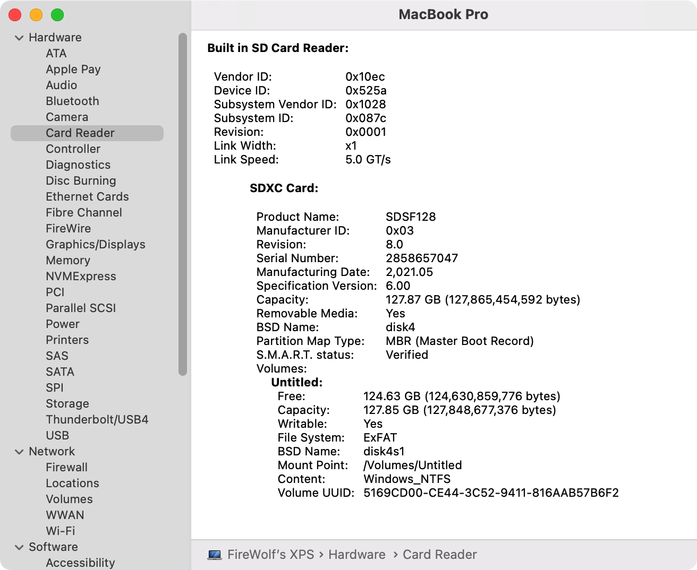

#  Realtek Card Reader Driver Friend

## Introduction

A Lilu plugin that makes System Information recognize your Realtek card reader as a native one.

## Supported Systems
- macOS Ventura
- macOS Monterey
- macOS Big Sur  
- macOS Catalina  
- macOS Mojave
- macOS High Sierra

#### Notes:
- Other systems are not tested yet.

## Dependencies
- [Lilu](https://github.com/acidanthera/Lilu) v1.4.7 or later.
- [RealtekCardReader](https://github.com/0xFireWolf/RealtekCardReader) v0.9.5 or later*.

#### Notes:
- If your have a builtin USB card reader that works out of box but does not show up in System Information, you may try the other Lilu plugin [GenericCardReaderFriend](https://github.com/0xFireWolf/GenericCardReaderFriend). In other words, your card reader is powered by neither `AppleUSBCardReader.kext` nor `RealtekCardReader.kext`.

## Support
If you would like to support my work, please consider a donation.  

## Boot Arguments
- `-rtsfoff` (or `-liluoff`) to disable
- `-rtsfdbg` (or `-liludbgall`) to enable verbose logging (in DEBUG builds)
- `-rtsfbeta` (or `-lilubetaall`) to enable on macOS newer than 12

## Credits
- [vit9696](https://github.com/vit9696) for [Lilu.kext](https://github.com/vit9696/Lilu)
- [Acidanthera](https://github.com/acidanthera) for [MacKernelSDK](https://github.com/acidanthera/MacKernelSDK)
- [FireWolf](https://github.com/0xFireWolf) for developing the card reader driver and its companion Lilu plugin for macOS

## License
This project is licensed under BSD-3-Clause.  
Copyright (C) 2021-2022 FireWolf @ FireWolf Pl. All Rights Reserved.
